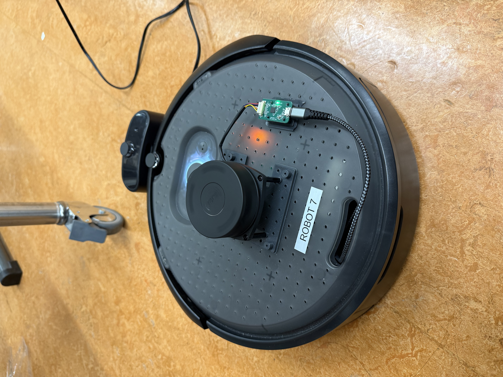

## Progress Presentation Group 7

### Progress so far:
1. Installed LiDAR and Raspberry Pi on Create3 Robot.

3. Can connect to the robot remotely through SSH.
4. Checked that LiDAR works with Foxglove.
5. Finished the ROS2 Crash Course.
