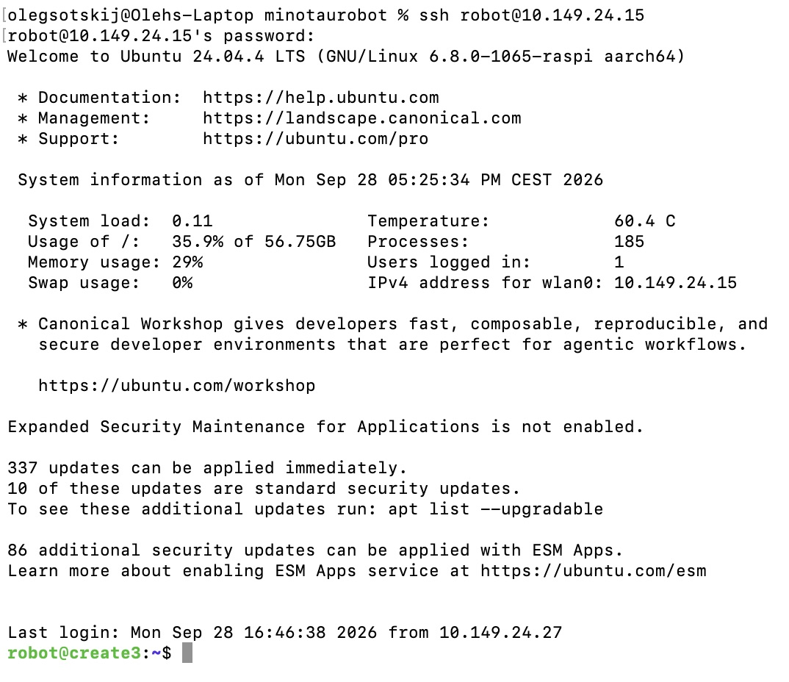
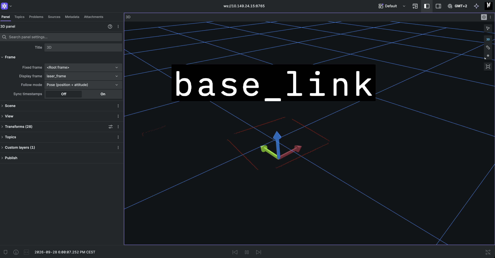

## Progress Presentation Group 7
Group members:
- Oleh Sotskyi
- Hermann Buma Afeseh-Bidnyugha
- Sami Akasha-Mohamed
### Progress so far:
#### 1. Installed LiDAR and Raspberry Pi on Create3 Robot.

#### 2. Can connect to the robot remotely through SSH.

#### 3. Checked that LiDAR works with Foxglove.

#### 4. Finished the ROS2 Crash Course.
